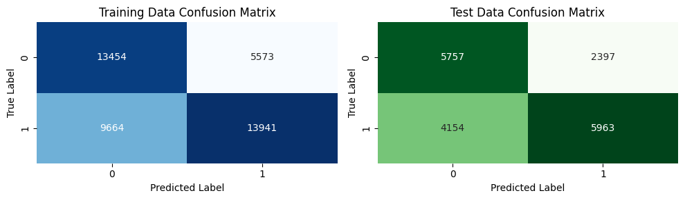
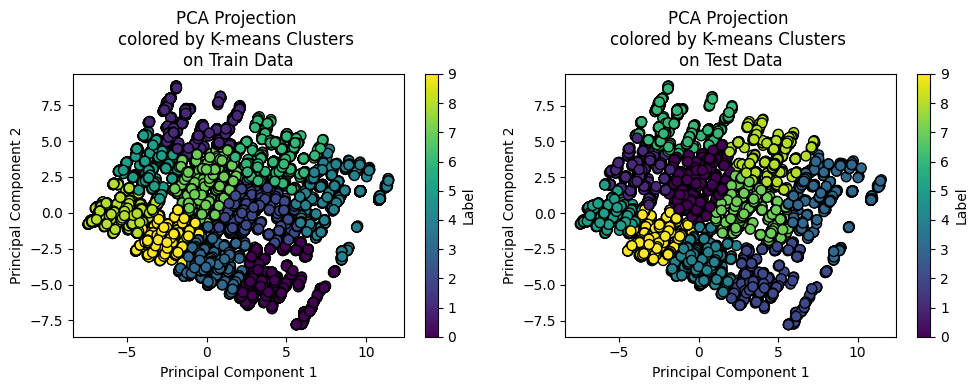

# Secondary Mushroom Dataset
### Noemi Foà

In this project, we focused on addressing two key objectives:

Predicting mushroom edibility: We used a Random Forest classifier to determine whether a given mushroom was edible or not.
Classifying mushroom species: We explored how many groups the mushroom species could be categorized into by applying K-means clustering and Principal Component Analysis (PCA).

# Index
- [Data exploration](#data-exploration)
    - [Dataset](#dataset)
    - [Plots](#plots)
- [Data transformation](#data-transformation)
    - [1. Missing values](#1-missing-values)
    - [2. Distribution and Outliers](#2-distribution-and-outliers)
    - [3. Encoding](#3-encoding)
- [Updated dataset](#updated-dataset)
- [Models](#models)
    - [Supervised learning models](##supervised-learning-models)
        - [Simple decision Tree](###simple-decision-tree)
        - [Random forest](###random-forest)
    - [Unsupervised learning](##unsupervised-learning)
        - [K-Means model](###K-Means-model)
        - [K-Means model after PCA](####K-Means-model-after-PCA)

# Data exploration

## Dataset
The dataset was loaded from https://archive.ics.uci.edu/dataset/848/secondary+mushroom+dataset.
It is defined by 61069 instances and 20 features. This dataset includes 61069 hypothetical mushrooms with caps based on 173 species (353 mushrooms per species). Each mushroom is identified as definitely edible, definitely poisonous, or of unknown edibility and not recommended (the latter class was combined with the poisonous class).

This dataset was inspired by the Mushroom Data Set of J. Schlimmer: url:https://archive.ics.uci.edu/ml/datasets/Mushroom.

### Target Labels

| Target | Description |
|----------|-----------|
| **class (m)** | Edible = e, Poisonous = p |
||
|*Note: (the poison class containing mushrooms of unknown edibility)*|

### 20 Remaining Variables (Nominal: n, Metrical: m)

| Variable | Description |
|----------|-------------|
| **cap-diameter (m)** | Float number in cm |
| **cap-shape (n)** | Bell = b, Conical = c, Convex = x, Flat = f, Sunken = s, Spherical = p, Others = o |
| **cap-surface (n)** | Fibrous = i, Grooves = g, Scaly = y, Smooth = s, Shiny = h, Leathery = l, Silky = k, Sticky = t, Wrinkled = w, Fleshy = e |
| **cap-color (n)** | Brown = n, Buff = b, Gray = g, Green = r, Pink = p, Purple = u, Red = e, White = w, Yellow = y, Blue = l, Orange = o, Black = k |
| **does-bruise-bleed (n)** | Bruises or bleeding = t, No = f |
| **gill-attachment (n)** | Adnate = a, Adnexed = x, Decurrent = d, Free = e, Sinuate = s, Pores = p, None = f, Unknown = ? |
| **gill-spacing (n)** | Close = c, Distant = d, None = f |
| **gill-color (n)** | See cap-color; none = f |
| **stem-height (m)** | Float number in cm |
| **stem-width (m)** | Float number in mm |
| **stem-root (n)** | Bulbous = b, Swollen = s, Club = c, Cup = u, Equal = e, Rhizomorphs = z, Rooted = r |
| **stem-surface (n)** | See cap-surface; none = f |
| **stem-color (n)** | See cap-color; none = f |
| **veil-type (n)** | Partial = p, Universal = u |
| **veil-color (n)** | See cap-color; none = f |
| **has-ring (n)** | Ring = t, None = f |
| **ring-type (n)** | Cobwebby = c, Evanescent = e, Flaring = r, Grooved = g, Large = l, Pendant = p, Sheathing = s, Zone = z, Scaly = y, Movable = m, None = f, Unknown = ? |
| **spore-print-color (n)** | See cap-color |
| **habitat (n)** | Grasses = g, Leaves = l, Meadows = m, Paths = p, Heaths = h, Urban = u, Waste = w, Woods = d |
| **season (n)** | Spring = s, Summer = u, Autumn = a, Winter = w |
||
|*Note: All variables are categorical except for cap-diameter, stem-height, and stem-width.* |

### Data import


```python
# library
import sys
import subprocess
import numpy as np
import matplotlib.pyplot as plt
import pandas as pd
import seaborn as sns

from sklearn.pipeline import Pipeline
from sklearn.preprocessing import OrdinalEncoder, LabelEncoder

from sklearn.model_selection import train_test_split
from sklearn.preprocessing import StandardScaler
from scipy.stats import skew
from sklearn.tree import DecisionTreeClassifier, plot_tree, export_text
from sklearn.ensemble import RandomForestClassifier
from sklearn.cluster import KMeans
from sklearn.decomposition import PCA
from sklearn.metrics import accuracy_score, confusion_matrix, classification_report, ConfusionMatrixDisplay
from sklearn.metrics import accuracy_score
from sklearn.metrics import silhouette_samples, silhouette_score
```


```python
def install_and_import(package):
    try:
        __import__(package)
    except ImportError:
        subprocess.check_call([sys.executable, "-m", "pip", "install", package])
    finally:
        globals()[package] = __import__(package)

# Check and install ucimlrepo if not already installed
install_and_import("ucimlrepo")

from ucimlrepo import fetch_ucirepo

# fetch dataset
secondary_mushroom = fetch_ucirepo(id=848)
print(type(secondary_mushroom))
# data (as pandas dataframes)
X = secondary_mushroom.data.features
y = secondary_mushroom.data.targets

df = pd.concat([X, y], axis=1)
# Save DataFrame to CSV
df.to_csv('secondary_mushroom_dataset.csv', index=False)
print(df.shape) #61069:2
```


```python
grouped = df.groupby(list(X.columns))

# Identify groups with more than one unique class
identical_rows_different_classes = grouped.filter(lambda x: x[y.name].nunique() > 1)

# Display the result
print(identical_rows_different_classes)
print(identical_rows_different_classes.shape)
```

### Data Head


```python
df.head(5) # print head
```


<div>
<style scoped>
    .dataframe tbody tr th:only-of-type {
        vertical-align: middle;
    }

    .dataframe tbody tr th {
        vertical-align: top;
    }

    .dataframe thead th {
        text-align: right;
    }
</style>
<table border="1" class="dataframe">
  <thead>
    <tr style="text-align: right;">
      <th></th>
      <th>cap-diameter</th>
      <th>cap-shape</th>
      <th>cap-surface</th>
      <th>cap-color</th>
      <th>does-bruise-or-bleed</th>
      <th>gill-attachment</th>
      <th>gill-spacing</th>
      <th>gill-color</th>
      <th>stem-height</th>
      <th>stem-width</th>
      <th>...</th>
      <th>stem-surface</th>
      <th>stem-color</th>
      <th>veil-type</th>
      <th>veil-color</th>
      <th>has-ring</th>
      <th>ring-type</th>
      <th>spore-print-color</th>
      <th>habitat</th>
      <th>season</th>
      <th>class</th>
    </tr>
  </thead>
  <tbody>
    <tr>
      <th>0</th>
      <td>15.26</td>
      <td>x</td>
      <td>g</td>
      <td>o</td>
      <td>f</td>
      <td>e</td>
      <td>NaN</td>
      <td>w</td>
      <td>16.95</td>
      <td>17.09</td>
      <td>...</td>
      <td>y</td>
      <td>w</td>
      <td>u</td>
      <td>w</td>
      <td>t</td>
      <td>g</td>
      <td>NaN</td>
      <td>d</td>
      <td>w</td>
      <td>p</td>
    </tr>
    <tr>
      <th>1</th>
      <td>16.60</td>
      <td>x</td>
      <td>g</td>
      <td>o</td>
      <td>f</td>
      <td>e</td>
      <td>NaN</td>
      <td>w</td>
      <td>17.99</td>
      <td>18.19</td>
      <td>...</td>
      <td>y</td>
      <td>w</td>
      <td>u</td>
      <td>w</td>
      <td>t</td>
      <td>g</td>
      <td>NaN</td>
      <td>d</td>
      <td>u</td>
      <td>p</td>
    </tr>
    <tr>
      <th>2</th>
      <td>14.07</td>
      <td>x</td>
      <td>g</td>
      <td>o</td>
      <td>f</td>
      <td>e</td>
      <td>NaN</td>
      <td>w</td>
      <td>17.80</td>
      <td>17.74</td>
      <td>...</td>
      <td>y</td>
      <td>w</td>
      <td>u</td>
      <td>w</td>
      <td>t</td>
      <td>g</td>
      <td>NaN</td>
      <td>d</td>
      <td>w</td>
      <td>p</td>
    </tr>
    <tr>
      <th>3</th>
      <td>14.17</td>
      <td>f</td>
      <td>h</td>
      <td>e</td>
      <td>f</td>
      <td>e</td>
      <td>NaN</td>
      <td>w</td>
      <td>15.77</td>
      <td>15.98</td>
      <td>...</td>
      <td>y</td>
      <td>w</td>
      <td>u</td>
      <td>w</td>
      <td>t</td>
      <td>p</td>
      <td>NaN</td>
      <td>d</td>
      <td>w</td>
      <td>p</td>
    </tr>
    <tr>
      <th>4</th>
      <td>14.64</td>
      <td>x</td>
      <td>h</td>
      <td>o</td>
      <td>f</td>
      <td>e</td>
      <td>NaN</td>
      <td>w</td>
      <td>16.53</td>
      <td>17.20</td>
      <td>...</td>
      <td>y</td>
      <td>w</td>
      <td>u</td>
      <td>w</td>
      <td>t</td>
      <td>p</td>
      <td>NaN</td>
      <td>d</td>
      <td>w</td>
      <td>p</td>
    </tr>
  </tbody>
</table>
<p>5 rows × 21 columns</p>
</div>


### Statistics for the numerical variables


```python
df.describe().round(2).T # description of only the numerical variables
```


<div>
<style scoped>
    .dataframe tbody tr th:only-of-type {
        vertical-align: middle;
    }

    .dataframe tbody tr th {
        vertical-align: top;
    }

    .dataframe thead th {
        text-align: right;
    }
</style>
<table border="1" class="dataframe">
  <thead>
    <tr style="text-align: right;">
      <th></th>
      <th>count</th>
      <th>mean</th>
      <th>std</th>
      <th>min</th>
      <th>25%</th>
      <th>50%</th>
      <th>75%</th>
      <th>max</th>
    </tr>
  </thead>
  <tbody>
    <tr>
      <th>cap-diameter</th>
      <td>61069.0</td>
      <td>6.73</td>
      <td>5.26</td>
      <td>0.38</td>
      <td>3.48</td>
      <td>5.86</td>
      <td>8.54</td>
      <td>62.34</td>
    </tr>
    <tr>
      <th>stem-height</th>
      <td>61069.0</td>
      <td>6.58</td>
      <td>3.37</td>
      <td>0.00</td>
      <td>4.64</td>
      <td>5.95</td>
      <td>7.74</td>
      <td>33.92</td>
    </tr>
    <tr>
      <th>stem-width</th>
      <td>61069.0</td>
      <td>12.15</td>
      <td>10.04</td>
      <td>0.00</td>
      <td>5.21</td>
      <td>10.19</td>
      <td>16.57</td>
      <td>103.91</td>
    </tr>
  </tbody>
</table>
</div>


The data do not seems to be imbalance as shown in the following table.


```python
pd.DataFrame(df['class'].value_counts().sort_index()).assign(
    percentage = lambda x: (x/x.sum()*100).round(2)
)
```


<div>
<style scoped>
    .dataframe tbody tr th:only-of-type {
        vertical-align: middle;
    }

    .dataframe tbody tr th {
        vertical-align: top;
    }

    .dataframe thead th {
        text-align: right;
    }
</style>
<table border="1" class="dataframe">
  <thead>
    <tr style="text-align: right;">
      <th></th>
      <th>count</th>
      <th>percentage</th>
    </tr>
    <tr>
      <th>class</th>
      <th></th>
      <th></th>
    </tr>
  </thead>
  <tbody>
    <tr>
      <th>e</th>
      <td>27181</td>
      <td>44.51</td>
    </tr>
    <tr>
      <th>p</th>
      <td>33888</td>
      <td>55.49</td>
    </tr>
  </tbody>
</table>
</div>


## Plots


```python
# Plots of the data
all_variables = df.columns[:-1]  # Exclude the target variable
target_variable = df.columns[-1]

num_vars = len(all_variables)

fig, axes = plt.subplots(4, 5, figsize=(20, 10))
axes = axes.flatten()

for i, variable in enumerate(all_variables):  # Histogram for each variable
    ax = axes[i]

    for class_label in df[target_variable].unique():  # Histogram per each class
        subset = df[df[target_variable] == class_label]
        ax.hist(subset[variable].dropna(), bins=20, alpha=0.5, label=f'Class {class_label}')

    ax.set_title(variable)
    ax.set_xlabel(variable)
    ax.set_ylabel('Frequency')
    ax.legend(loc='best')
    ax.grid(True)

for j in range(num_vars, len(axes)):
    fig.delaxes(axes[j])

plt.tight_layout()
plt.show()
```


    

    


# Data transformation
In this section, we will focus on preparing the data to be used in the next applications. We will have to adress missing values and examining the skewness of numerical data, and econde the cathegorical features.

### 1. Missing Values


```python
# List of variables with missing values
variables_with_missing = [
    'cap-surface',
    'gill-attachment',
    'gill-spacing',
    'stem-root',
    'stem-surface',
    'veil-type',
    'veil-color',
    'ring-type',
    'spore-print-color'
]

total_rows = len(df)
missing_values_proportion = df[variables_with_missing].isnull().sum() / total_rows

plt.figure(figsize=(10, 5))
ax = missing_values_proportion.plot(kind='bar', color='skyblue')
plt.title('Proportion of Missing Values')
plt.xlabel('Variables')
plt.ylabel('Proportion of Missing Values')
plt.xticks(rotation=45)

# Annotate each bar with the proportion value
for index, value in enumerate(missing_values_proportion):
    plt.text(index, value, f"{value:.2f}", ha='center', va='bottom')

plt.tight_layout()
plt.show()
```


    

    


In order to investigate the missing data, we created a frequency histogram that illustrates the proportions of missing values over the total. The histogram revealed that the following variables have a high percentage of missing values:

- stem-root, veil-type, veil-color, and spore-print-color have more than 84% missing values
- stem-surface has over 60% missing values

As a result, we have decided to drop the variables with more than 50% missing values.


```python
df=df.drop(['gill-attachment',
            'gill-spacing',
            'cap-surface',
            'stem-root',
            'stem-surface',
            'veil-type',
            'veil-color',
            'spore-print-color'], axis=1)
```


```python
df.isnull().sum() # how many NA we have
```


    cap-diameter               0
    cap-shape                  0
    cap-color                  0
    does-bruise-or-bleed       0
    gill-color                 0
    stem-height                0
    stem-width                 0
    stem-color                 0
    has-ring                   0
    ring-type               2471
    habitat                    0
    season                     0
    class                      0
    dtype: int64


### 2. Distribution and Outliers

In the dataset we have only numerical variables; cap-diameter, stem-height, and stem-width. For all of them, there is observed skewness, to address it we applied a log transformation followed by standardization to ensure they have comparable scales.


```python
# Select the numerical columns
numerical_columns = ['cap-diameter', 'stem-height', 'stem-width']

###################### Orignal Data
skewness_before = df[numerical_columns].apply(lambda x: skew(x.dropna()))
print("Skewness before transformation:")
print(skewness_before)

range_before = df[numerical_columns].agg([min, max])
print("\nRange before transformation:")
print(range_before)

# Apply log transformation to correct skewness
df_log_transformed = df.copy()
for col in numerical_columns:
    df_log_transformed[col] = np.log1p(df_log_transformed[col]) 

# Standardize the log-transformed data
scaler = StandardScaler()
df_log_transformed[numerical_columns] = scaler.fit_transform(df_log_transformed[numerical_columns])

###################### After transformation
skewness_after = df_log_transformed[numerical_columns].apply(lambda x: skew(x.dropna()))
print("\nSkewness after transformation and standardization:")
print(skewness_after)

range_after = df_log_transformed[numerical_columns].agg([min, max])
print("\nRange after transformation and standardization:")
print(range_after)

####################### Plot distributions before and after log transformation and standardization
fig, axes = plt.subplots(2, 3, figsize=(18, 10))

for i, col in enumerate(numerical_columns):
    # Original data distribution
    sns.histplot(df[col].dropna(), kde=True, ax=axes[0, i], color='skyblue')
    axes[0, i].set_title(f'Original {col} Distribution')

    # Log-transformed and standardized data distribution
    sns.histplot(df_log_transformed[col].dropna(), kde=True, ax=axes[1, i], color='salmon')
    axes[1, i].set_title(f'Log-Transformed & Standardized {col} Distribution')
plt.tight_layout()
plt.show()

# Plot boxplots before and after log transformation and standardization
fig, ax = plt.subplots(1, 2, figsize=(15, 3))

ax[0].boxplot([df[col].dropna() for col in numerical_columns], patch_artist=True)
ax[0].set_xticklabels(numerical_columns)
ax[0].set_title('Boxplots of Original Data')
ax[0].set_ylabel('Value')

# Log-transformed and standardized data boxplot
ax[1].boxplot([df_log_transformed[col].dropna() for col in numerical_columns], patch_artist=True)
ax[1].set_xticklabels(numerical_columns)
ax[1].set_title('Boxplots of Log-Transformed & Standardized Data')
ax[1].set_ylabel('Value')
plt.show()
```

    Skewness before transformation:
    cap-diameter    3.822750
    stem-height     2.020854
    stem-width      2.164904
    dtype: float64
    
    Range before transformation:
         cap-diameter  stem-height  stem-width
    min          0.38         0.00        0.00
    max         62.34        33.92      103.91
    
    Skewness after transformation and standardization:
    cap-diameter   -0.038217
    stem-height    -1.024109
    stem-width     -0.486590
    dtype: float64
    
    Range after transformation and standardization:
         cap-diameter  stem-height  stem-width
    min     -2.684863    -4.340585   -2.886179
    max      3.923981     3.630076    2.961523
    

    C:\Users\noemi\AppData\Local\Temp\ipykernel_6216\1790663888.py:9: FutureWarning: The provided callable <built-in function min> is currently using Series.min. In a future version of pandas, the provided callable will be used directly. To keep current behavior pass the string "min" instead.
      range_before = df[numerical_columns].agg([min, max])
    C:\Users\noemi\AppData\Local\Temp\ipykernel_6216\1790663888.py:9: FutureWarning: The provided callable <built-in function max> is currently using Series.max. In a future version of pandas, the provided callable will be used directly. To keep current behavior pass the string "max" instead.
      range_before = df[numerical_columns].agg([min, max])
    C:\Users\noemi\AppData\Local\Temp\ipykernel_6216\1790663888.py:27: FutureWarning: The provided callable <built-in function min> is currently using Series.min. In a future version of pandas, the provided callable will be used directly. To keep current behavior pass the string "min" instead.
      range_after = df_log_transformed[numerical_columns].agg([min, max])
    C:\Users\noemi\AppData\Local\Temp\ipykernel_6216\1790663888.py:27: FutureWarning: The provided callable <built-in function max> is currently using Series.max. In a future version of pandas, the provided callable will be used directly. To keep current behavior pass the string "max" instead.
      range_after = df_log_transformed[numerical_columns].agg([min, max])
    


    

    


    

    


```python
df.describe().T
```


<div>
<style scoped>
    .dataframe tbody tr th:only-of-type {
        vertical-align: middle;
    }

    .dataframe tbody tr th {
        vertical-align: top;
    }

    .dataframe thead th {
        text-align: right;
    }
</style>
<table border="1" class="dataframe">
  <thead>
    <tr style="text-align: right;">
      <th></th>
      <th>count</th>
      <th>mean</th>
      <th>std</th>
      <th>min</th>
      <th>25%</th>
      <th>50%</th>
      <th>75%</th>
      <th>max</th>
    </tr>
  </thead>
  <tbody>
    <tr>
      <th>cap-diameter</th>
      <td>61069.0</td>
      <td>6.733854</td>
      <td>5.264845</td>
      <td>0.38</td>
      <td>3.48</td>
      <td>5.86</td>
      <td>8.54</td>
      <td>62.34</td>
    </tr>
    <tr>
      <th>stem-height</th>
      <td>61069.0</td>
      <td>6.581538</td>
      <td>3.370017</td>
      <td>0.00</td>
      <td>4.64</td>
      <td>5.95</td>
      <td>7.74</td>
      <td>33.92</td>
    </tr>
    <tr>
      <th>stem-width</th>
      <td>61069.0</td>
      <td>12.149410</td>
      <td>10.035955</td>
      <td>0.00</td>
      <td>5.21</td>
      <td>10.19</td>
      <td>16.57</td>
      <td>103.91</td>
    </tr>
  </tbody>
</table>
</div>


```python
df_log_transformed.describe().T
```


<div>
<style scoped>
    .dataframe tbody tr th:only-of-type {
        vertical-align: middle;
    }

    .dataframe tbody tr th {
        vertical-align: top;
    }

    .dataframe thead th {
        text-align: right;
    }
</style>
<table border="1" class="dataframe">
  <thead>
    <tr style="text-align: right;">
      <th></th>
      <th>count</th>
      <th>mean</th>
      <th>std</th>
      <th>min</th>
      <th>25%</th>
      <th>50%</th>
      <th>75%</th>
      <th>max</th>
    </tr>
  </thead>
  <tbody>
    <tr>
      <th>cap-diameter</th>
      <td>61069.0</td>
      <td>-1.303129e-16</td>
      <td>1.000008</td>
      <td>-2.684863</td>
      <td>-0.651070</td>
      <td>0.084844</td>
      <td>0.654436</td>
      <td>3.923981</td>
    </tr>
    <tr>
      <th>stem-height</th>
      <td>61069.0</td>
      <td>3.127510e-16</td>
      <td>1.000008</td>
      <td>-4.340585</td>
      <td>-0.459896</td>
      <td>0.008639</td>
      <td>0.522738</td>
      <td>3.630076</td>
    </tr>
    <tr>
      <th>stem-width</th>
      <td>61069.0</td>
      <td>8.377258e-16</td>
      <td>1.000008</td>
      <td>-2.886179</td>
      <td>-0.591185</td>
      <td>0.148854</td>
      <td>0.715856</td>
      <td>2.961523</td>
    </tr>
  </tbody>
</table>
</div>


### 3. Encoding

The features and target variable need to be encoded as numerical values for many machine learning algorithms to work properly. We chose to adopt the following edncoding methods:

* **Ordinal Encoding** - Used to encode categorical features. It assigns integer values to each category.
* **Label Encoding** - Used for encoding the target variable into numerical labels. Useful for classification problems where the target variable is categorical.

##### Justification for using ordinal encoding method for the random forest model

Ordinal encoding is suitable for ordinal categorical variables with a clear and meaningful order, or when using models that are insensitive to ordinal relationships, such as decision trees and tree-based ensembles (e.g., random forests).

Alternative methods include One-Hot Encoding, which is often used when the number of categories is manageable and the categories have no ordinal relationship. However, it can lead to a significant increase in the dimensionality of the dataset, especially if there are many unique categories. Therefore, in this case, we will adopt the ordinal encoding method.


```python
# from sklearn.preprocessing import OrdinalEncoder
# from sklearn.preprocessing import LabelEncoder

df = df_log_transformed.copy()

# Encoding the features
cat_cols_train = df.select_dtypes(include=['object']).columns
cat_cols_train = cat_cols_train[cat_cols_train != 'class']

ordinal_encoder = OrdinalEncoder(handle_unknown='use_encoded_value', unknown_value=-1)

df[cat_cols_train] = ordinal_encoder.fit_transform(df[cat_cols_train].astype(str))

# Encoding the label
le = LabelEncoder()
df['class'] = le.fit_transform(df['class'])
```


```python
df.head()
```


<div>
<style scoped>
    .dataframe tbody tr th:only-of-type {
        vertical-align: middle;
    }

    .dataframe tbody tr th {
        vertical-align: top;
    }

    .dataframe thead th {
        text-align: right;
    }
</style>
<table border="1" class="dataframe">
  <thead>
    <tr style="text-align: right;">
      <th></th>
      <th>cap-diameter</th>
      <th>cap-shape</th>
      <th>cap-color</th>
      <th>does-bruise-or-bleed</th>
      <th>gill-color</th>
      <th>stem-height</th>
      <th>stem-width</th>
      <th>stem-color</th>
      <th>has-ring</th>
      <th>ring-type</th>
      <th>habitat</th>
      <th>season</th>
      <th>class</th>
    </tr>
  </thead>
  <tbody>
    <tr>
      <th>0</th>
      <td>1.575380</td>
      <td>6.0</td>
      <td>6.0</td>
      <td>0.0</td>
      <td>10.0</td>
      <td>2.137213</td>
      <td>0.752511</td>
      <td>11.0</td>
      <td>1.0</td>
      <td>2.0</td>
      <td>0.0</td>
      <td>3.0</td>
      <td>1</td>
    </tr>
    <tr>
      <th>1</th>
      <td>1.712155</td>
      <td>6.0</td>
      <td>6.0</td>
      <td>0.0</td>
      <td>10.0</td>
      <td>2.263562</td>
      <td>0.826695</td>
      <td>11.0</td>
      <td>1.0</td>
      <td>2.0</td>
      <td>0.0</td>
      <td>2.0</td>
      <td>1</td>
    </tr>
    <tr>
      <th>2</th>
      <td>1.444113</td>
      <td>6.0</td>
      <td>6.0</td>
      <td>0.0</td>
      <td>10.0</td>
      <td>2.241004</td>
      <td>0.796874</td>
      <td>11.0</td>
      <td>1.0</td>
      <td>2.0</td>
      <td>0.0</td>
      <td>3.0</td>
      <td>1</td>
    </tr>
    <tr>
      <th>3</th>
      <td>1.455536</td>
      <td>2.0</td>
      <td>1.0</td>
      <td>0.0</td>
      <td>10.0</td>
      <td>1.984670</td>
      <td>0.672930</td>
      <td>11.0</td>
      <td>1.0</td>
      <td>6.0</td>
      <td>0.0</td>
      <td>3.0</td>
      <td>1</td>
    </tr>
    <tr>
      <th>4</th>
      <td>1.508235</td>
      <td>6.0</td>
      <td>6.0</td>
      <td>0.0</td>
      <td>10.0</td>
      <td>2.084099</td>
      <td>0.760129</td>
      <td>11.0</td>
      <td>1.0</td>
      <td>6.0</td>
      <td>0.0</td>
      <td>3.0</td>
      <td>1</td>
    </tr>
  </tbody>
</table>
</div>


```python
# checking for dublicates rows
df_clean=df.drop_duplicates()
print(df.shape, 
df_clean.shape)
```

    (61069, 13) (60903, 13)
    

# Updated dataset

The dataset has been divided into 70% training data and 30% test data. The final dataset consists of 60,903 rows and 13 columns. The correlation matrix shows that three variables are highly correlated. However, as we will discuss later, these variables will not be excluded from the next analysis.


```python
# from sklearn.pipeline import Pipeline
# traing and test
X = df_clean.drop(columns='class')
y = df_clean['class'] 

#print(df_clean.shape) # (61069, 13)

# Data split 0.4 
X_train, X_test, y_train, y_test = train_test_split(X, y, test_size=0.3, random_state=42, stratify=y)
#print(X_train)
```


```python
for col in cat_cols_train:
    unique_vals = df_clean[col].nunique()
    if unique_vals == 1:
        print(f"Column {col} has only one unique value.")

#print(df[cat_cols_train].dtypes)
```


```python
# Compute correlation matrix
correlation_matrix = df_clean.corr()

# Plot correlation heatmap
plt.figure(figsize=(12, 8))
sns.heatmap(correlation_matrix, annot=True, cmap='coolwarm', fmt='.2f', linewidths=0.5)
plt.title('Correlation Heatmap')
plt.xticks(rotation=45)
plt.show()
```


    

    


```python
pd.DataFrame(df_clean['class'].value_counts().sort_index()).assign(
    percentage = lambda x: (x/x.sum()*100).round(2)
)
```


<div>
<style scoped>
    .dataframe tbody tr th:only-of-type {
        vertical-align: middle;
    }

    .dataframe tbody tr th {
        vertical-align: top;
    }

    .dataframe thead th {
        text-align: right;
    }
</style>
<table border="1" class="dataframe">
  <thead>
    <tr style="text-align: right;">
      <th></th>
      <th>count</th>
      <th>percentage</th>
    </tr>
    <tr>
      <th>class</th>
      <th></th>
      <th></th>
    </tr>
  </thead>
  <tbody>
    <tr>
      <th>0</th>
      <td>27181</td>
      <td>44.63</td>
    </tr>
    <tr>
      <th>1</th>
      <td>33722</td>
      <td>55.37</td>
    </tr>
  </tbody>
</table>
</div>


# Models

## Supervised learning models

In this session, we will be using supervised learning models to predict whether a mushroom is poisonous. We will start by addressing the classification problem using a decision tree model. If the decision tree's performance is not up to the mark, we will then try a random forest model. 

Both decision trees and random forests have their advantages. Decision trees are easy to interpret, which makes it simpler to understand the model's decision-making process. However, they are prone to overfitting, especially with complex datasets or very deep trees. Even a pruned decision tree may end up being too large.

On the other hand, random forests are more suitable for complex datasets due to their ensemble learning approach, which combines multiple decision trees to improve overall accuracy and reduce overfitting. Nevertheless, they come with a con: higher computational cost and longer training times. As the number of trees in the forest increases, the model can become less interpretable and complicate the understanding of the decision-making process compared to single decision trees.

### Simple decision tree


```python
# Create and train the decision tree classifier
tree_model = DecisionTreeClassifier(random_state=42, max_depth=5, criterion='entropy', class_weight=None)
tree_model.fit(X_train, y_train)

# Make predictions
y_pred = tree_model.predict(X_test)
```


```python
y_train_pred = tree_model.predict(X_train)
train_accuracy = accuracy_score(y_train, y_train_pred)
```


```python
# feature importances for the decision tree
feature_importances = tree_model.feature_importances_
sorted_indices = np.argsort(feature_importances)

plt.figure(figsize=(6, 3))
plt.barh(range(len(sorted_indices)), feature_importances[sorted_indices], align='center')
plt.yticks(range(len(sorted_indices)), [X.columns[i] for i in sorted_indices])
plt.xlabel('Feature Importance')
plt.title('Feature Importances of the Decision Tree Model')
plt.show()
```


    

    


### Results
Initially, a simple decision tree was fitted to the data with a maximum depth of 5. 
The accuracy matrix indicates that the model's performance is only 0.64.


```python
print(f"Training Accuracy: {train_accuracy:.2f}")# Accuracy on test data
#y_pred = tree_model.predict(X_test)
test_accuracy = accuracy_score(y_test, y_pred)
print(f"Test Accuracy: {test_accuracy:.2f}")


# Confusion matrix SIMPLE MODEL
conf_matrix_train = confusion_matrix(y_train, y_train_pred)
conf_matrix_test = confusion_matrix(y_test, y_pred)

###############################################################################
# Plot heatmap for training data
plt.figure(figsize=(5, 3))

plt.subplot(1, 2, 1)
sns.heatmap(conf_matrix_train, annot=True, fmt='d', cmap='Blues', cbar=False)
plt.title('Training Data Confusion Matrix')
plt.xlabel('Predicted Label')
plt.ylabel('True Label')

# Plot heatmap for test data
plt.subplot(1, 2, 2)
sns.heatmap(conf_matrix_test, annot=True, fmt='d', cmap='Greens', cbar=False)
plt.title('Test Data Confusion Matrix')
plt.xlabel('Predicted Label')
plt.ylabel('True Label')

plt.tight_layout()
plt.show()
```

    Training Accuracy: 0.64
    Test Accuracy: 0.64
    


    

    


```python
# Plot the decision tree
from sklearn import tree
import matplotlib.pyplot as plt

plt.figure(figsize=(20, 10))
tree.plot_tree(tree_model, filled=True, feature_names=X.columns, class_names=['class_0', 'class_1'])
plt.show()
```


    

    


### Random forest

To improve the model’s performance, we will apply a random forest algorithm. To find the optimal combination of hyperparameters was used the grid search by evaluating multiple models through cross-validation.

The best model is selected based on cross-validation accuracy and then assessed on the test set.

The optimal hyperparameters are:
* Bootstrap: True
* Class Weight: None
* Maximum Depth: 10
* Maximum Features: 'sqrt'
* Minimum Samples per Leaf: 1
* Minimum Samples per Split: 7
* Number of Estimators: 200
############################################################### code used to find the best hyperparameter
param_grid = {
    'n_estimators': [50, 100, 200],  # Number of trees in the forest
    'max_depth': [2,3,5, 10],  # Maximum depth of each tree
    'min_samples_split': [2, 7, 10, 15, 20],  # Minimum number of samples required to split an internal node
    'min_samples_leaf': [1, 2, 5,7, 10],  # Minimum number of samples required to be at a leaf node
    'max_features': [None, 'sqrt', 'log2'],  # Number of features to consider when looking for the best split
    'bootstrap': [True, False],  # Whether bootstrap samples are used when building trees
    'class_weight': [None, 'balanced']  # Class weights for handling imbalanced classes
}

# Perform grid search with cross-validation
grid_search = GridSearchCV(RandomForestClassifier(random_state=42), param_grid, cv=5, scoring='accuracy', n_jobs=-1)
grid_search.fit(X_train, y_train)

```python
# Initialize the Random Forest Classifier with the specified parameters
rf_model = RandomForestClassifier(
    n_estimators=200,          
    max_depth=10,              
    min_samples_split=7,       
    min_samples_leaf=1,        
    max_features='sqrt',       
    bootstrap=True,            
    class_weight=None,         
    random_state=42           
)

# Train the Random Forest Classifier
rf_model.fit(X_train, y_train)

# Make predictions
y_train_pred = rf_model.predict(X_train)
y_pred = rf_model.predict(X_test)

print("Random Forest; Train accuracy:", round(accuracy_score(y_train, y_train_pred), 4),
      "Test accuracy:", round(accuracy_score(y_test, y_pred), 4))

conf_matrix_rf_train = confusion_matrix(y_train, y_train_pred)
conf_matrix_rf = confusion_matrix(y_test, y_pred)

# Plot the confusion matrix
plt.figure(figsize=(10, 3))

plt.subplot(1, 2, 1)
sns.heatmap(conf_matrix_rf_train, annot=True, fmt='d', cmap='Blues')
plt.xlabel('Predicted Label')
plt.ylabel('True Label')
plt.title('Confusion Matrix on the Train data')

plt.subplot(1, 2, 2)
sns.heatmap(conf_matrix_rf, annot=True, fmt='d', cmap='Greens')
plt.xlabel('Predicted Label')
plt.ylabel('True Label')
plt.title('Confusion Matrix on the Test data')
plt.show()
```

    Random Forest; Train accuracy: 0.9587 Test accuracy: 0.9552
    


    

    


#### Summary
To improve the performance of the initial decision tree model, we transitioned to a more sophisticated random forest model and fine-tuned its parameters. The optimized model achieved a training accuracy of 95.8% and a test accuracy of 95.5%. 

### Conclusion
The random forest model significantly outperforms the initial decision tree, demonstrating its suitability for more accurate predictions.

## Unsupervised learning

In this section, we will apply the K-Means algorithm to an unsupervised learning model to identify patterns among the 173 mushroom species. To assess the generalization of the model, we will run it on both the training and test datasets and evaluate the results using the Silhouette Score. This score will help us determine how effectively the model clusters the data by measuring the cohesion within clusters and the separation between them.

In this model, the K-clusters of interest can be identified using pre-knowledge, silhouette, and elbow methods. We are using all three to improve our understanding:
- Previous knowledge suggests that K can be 2 or 3 (for poison vs. non-poison classification) or 173 (for the species of each mushroom).
- By focusing on silhouette values and the elbow method, we find that the best K is equal to 9. This seems reasonable as it could mean that some species of mushrooms can be grouped into the same clusters due to their similarity or other hidden properties.

Comparing the model using PCA and running it on the training data, K=10 gives better results in terms of silhouette.

### K-Means model

To determine the optimal number of clusters (K) for the data, we will use insights from both the Elbow method and the Silhouette method.


```python
# List to store the sum of squared distances (SSE)
sse = []

# Test different numbers of clusters for the Elbow Method
for k in range(1, 11):
    kmeans = KMeans(n_clusters=k, random_state=42, n_init=10)
    kmeans.fit(X_train)
    sse.append(kmeans.inertia_)

# List to store the silhouette scores
sil_scores = []

# Test different numbers of clusters for Silhouette Score
for k in range(2, 11):  # Start from 2 as silhouette score is not defined for k=1
    kmeans = KMeans(n_clusters=k, random_state=42, n_init=10)
    y_train_pred = kmeans.fit_predict(X_train)
    sil_score = silhouette_score(X_train, y_train_pred)
    sil_scores.append(sil_score)

plt.figure(figsize=(10, 4))
# Plot the Elbow method (SSE vs number of clusters)
plt.subplot(1, 2, 1)
plt.plot(range(1, 11), sse, marker='o', color='blue')
plt.title('Elbow Method For Optimal k')
plt.xlabel('Number of clusters')
plt.ylabel('Sum of squared distances (SSE)')

# Plot the Silhouette Scores
plt.subplot(1, 2, 2)
plt.plot(range(2, 11), sil_scores, marker='o', color='green')
plt.title('Silhouette Scores For Different k')
plt.xlabel('Number of clusters')
plt.ylabel('Silhouette Score')
plt.tight_layout()
plt.show()
```


    

    


```python
# Given the information form the shiloutte and etc we will run the code with k= 9
# Create the K-Means model with random_state=42
kmeans = KMeans(n_clusters=9, random_state=42)
# Train the K-Means model on the training data andgGet the cluster labels for X_train
train_labels = kmeans.fit_predict(X_train)
```


```python
############################################################################### Silhouette Scores Plot
# Test different numbers of clusters for Silhouette Score
for k in range(2, 11):  # Start from 2 as silhouette score is not defined for k=1
    kmeans = KMeans(n_clusters=k, random_state=42, n_init=10)
    y_train_pred = kmeans.fit_predict(X_train)
    sil_score = silhouette_score(X_train, y_train_pred)
    sil_scores.append(sil_score)
###

silhouette_vals = silhouette_samples(X_train, train_labels)

# Plot the Silhouette Scores
fig, ax_2 = plt.subplots(figsize=(10, 4))

# Sort the silhouette values and assign them to clusters
sil_df = pd.DataFrame({
    'silhouette_score': silhouette_vals,
    'cluster': train_labels
})
sil_df.sort_values(by='silhouette_score', inplace=True)

# Plot silhouette scores for each cluster
n_clusters = len(sil_df['cluster'].unique())
colors = sns.color_palette('hsv', n_clusters)  # Generate a color palette for clusters

y_lower = 10
for i in range(n_clusters):
    cluster_i = sil_df[sil_df['cluster'] == i]
    cluster_size = cluster_i.shape[0]
    y_upper = y_lower + cluster_size

    color = colors[i]
    ax_2.fill_betweenx(np.arange(y_lower, y_upper),
                       0, cluster_i['silhouette_score'],
                       facecolor=color, edgecolor=color, alpha=0.5)
    # ax_2.text(-0.2, y_lower + 0.5 * cluster_size,
    #           f'Cluster # {str(i)}',
    #           weight='bold', size=10, color='black')
    y_lower = y_upper + 10

# Calculate and plot the average silhouette score
_silh_score = silhouette_score(X_train, train_labels)
ax_2.axvline(x=_silh_score, color='red', linestyle='--', label=f'Average Silhouette Score: {_silh_score:.2f}')
ax_2.set_title('Silhouette Scores for K=9')
ax_2.set_xlabel('Silhouette Score')
ax_2.set_ylabel('Cluster index')
ax_2.legend()
plt.show()
```


    

    


#### Summary
The optimal choice of K for this model is K=9, with a Silhouette Score of S=0.225. To improve the model, we will apply PCA and evaluate the result based on the Silhouette Score.

### K-Means model after PCA

Based on the previous results, we employed dimensionality reduction to determine the optimal number of principal components (PC) that strikes a balance between model complexity and performance. We will be exploring various combinations of PC and cluster numbers (K) to pinpoint the Silhouette Score that offers the most effective trade-off between complexity and performance.


```python
# Define ranges for PCA components and number of clusters
pca_components_range = [2, 3]#, 7, 10]  
cluster_range = (2, 3, 4, 5, 6, 7, 8, 9, 10, 11, 12, 13, 14, 15) 

# Initialize matrix to hold silhouette scores
silhouette_scores_matrix = np.zeros((len(pca_components_range), len(cluster_range)))

# Load your data and perform PCA
for i, num_components in enumerate(pca_components_range):
    pca = PCA(n_components=num_components, random_state=42)
    X_train_pca = pca.fit_transform(X_train)

    for j, num_clusters in enumerate(cluster_range):
        kmeans = KMeans(n_clusters=num_clusters, random_state=42)
        kmeans.fit(X_train_pca)
        labels = kmeans.labels_
        silhouette_avg = silhouette_score(X_train_pca, labels)
        silhouette_scores_matrix[i, j] = silhouette_avg
```


```python
# Plotting the heatmap of the silhouette for differnet pca and k
plt.figure(figsize=(10, 2))
ax = sns.heatmap(silhouette_scores_matrix, annot=True, fmt=".2f", cmap="YlGnBu",
                 xticklabels=cluster_range,
                 yticklabels=pca_components_range)
ax.set_xlabel('Number of Clusters')
ax.set_ylabel('Number of PCA Components')
plt.title('Silhouette Scores for Different PCA Components and Number of Clusters')
plt.show()
```


    

    


Based on the grid plot analysis, the best combination of PCA and K is found to be K=10. The grid plot shows that using PCA with PC=2 significantly enhances the Silhouette Score, increasing it to 0.5. For context, the Silhouette Score ranges are as follows:
- 1.0: Perfectly separated clusters (high cohesion and separation).
- 0.5 to 0.7: Reasonable clustering with some overlap.
- 0.2 to 0.5: Clusters are somewhat overlapping or not well-separated.
- Below 0.2: Poor clustering with significant overlap or incorrect number of clusters.

We can conclude that choosing K=10 strikes the best balance between maximizing the Silhouette Score and avoiding overfitting, resulting in a score of 0.5. The upcoming plot will visualize the data both before and after clustering.

#### Results


```python
# Setting PC=2, for all the next evaluations
optimal_pca_components = 2  

pca = PCA(n_components=optimal_pca_components, random_state=42)
X_train_pca = pca.fit_transform(X_train)
X_test_pca = pca.transform(X_test)
```


```python
optimal_num_clusters = 10  

kmeans = KMeans(n_clusters=optimal_num_clusters, random_state=42)
train_labels = kmeans.fit_predict(X_train_pca)

################################################################### Calculate Silhouette Scores
silhouette_vals = silhouette_samples(X_train_pca, train_labels)

# Plot the Silhouette Scores
fig, ax_2 = plt.subplots(figsize=(10, 4))

df = pd.DataFrame({
    'silhouette_score': silhouette_vals,
    'cluster': train_labels
})
df.sort_values(by='silhouette_score', inplace=True)

# Plot silhouette scores for each cluster
n_clusters = len(df['cluster'].unique())
colors = sns.color_palette('hsv', n_clusters)  

y_lower = 10
for i in range(n_clusters):
    cluster_i = df[df['cluster'] == i]
    cluster_size = cluster_i.shape[0]
    y_upper = y_lower + cluster_size

    color = colors[i]
    ax_2.fill_betweenx(np.arange(y_lower, y_upper),
                       0, cluster_i['silhouette_score'],
                       facecolor=color, edgecolor=color, alpha=0.5)
    y_lower = y_upper + 10

# Calculate and plot the average silhouette score
plt.figure(figsize=(10, 4))
_silh_score = silhouette_score(X_train_pca, train_labels)
ax_2.axvline(x=_silh_score, color='red', linestyle='--', label=f'Average Silhouette Score: {_silh_score:.2f}')
ax_2.set_title('Silhouette Scores for K=10 after PCA on Train Data')
ax_2.set_xlabel('Silhouette Score')
ax_2.set_ylabel('Sample index')
ax_2.legend()
plt.show()
```


    

    


    <Figure size 1000x400 with 0 Axes>


```python
optimal_num_clusters = 10  

kmeans = KMeans(n_clusters=optimal_num_clusters, random_state=42)
test_labels = kmeans.fit_predict(X_test_pca)

################################################################### Calculate Silhouette Scores
silhouette_vals = silhouette_samples(X_test_pca, test_labels)

# Plot the Silhouette Scores
fig, ax_2 = plt.subplots(figsize=(10, 4))

df = pd.DataFrame({
    'silhouette_score': silhouette_vals,
    'cluster': test_labels
})
df.sort_values(by='silhouette_score', inplace=True)

# Plot silhouette scores for each cluster
n_clusters = len(df['cluster'].unique())
colors = sns.color_palette('hsv', n_clusters)  

y_lower = 10
for i in range(n_clusters):
    cluster_i = df[df['cluster'] == i]
    cluster_size = cluster_i.shape[0]
    y_upper = y_lower + cluster_size

    color = colors[i]
    ax_2.fill_betweenx(np.arange(y_lower, y_upper),
                       0, cluster_i['silhouette_score'],
                       facecolor=color, edgecolor=color, alpha=0.5)
    y_lower = y_upper + 10

# Calculate and plot the average silhouette score
_silh_score = silhouette_score(X_test_pca, test_labels)
ax_2.axvline(x=_silh_score, color='red', linestyle='--', label=f'Average Silhouette Score: {_silh_score:.2f}')
ax_2.set_title('Silhouette Scores for K=10 after PCA on Test Data')
ax_2.set_xlabel('Silhouette Score')
ax_2.set_ylabel('Sample index')
ax_2.legend()
plt.show()
```


    

    


```python
# Plot the PCA results to analyze the clusters
plt.figure(figsize=(10, 4))
# Plot the Elbow method (SSE vs number of clusters)
plt.subplot(1, 2, 1)
scatter = plt.scatter(X_train_pca[:, 0], X_train_pca[:, 1], c=train_labels, cmap='viridis', edgecolor='k', s=50)
plt.title('PCA Projection \ncolored by K-means Clusters \non Train Data')
plt.xlabel('Principal Component 1')
plt.ylabel('Principal Component 2')
plt.colorbar(scatter, label='Label')

plt.subplot(1, 2, 2)
scatter = plt.scatter(X_test_pca[:, 0], X_test_pca[:, 1], c=test_labels, cmap='viridis', edgecolor='k', s=50)
plt.title('PCA Projection \ncolored by K-means Clusters \non Test Data')
plt.xlabel('Principal Component 1')
plt.ylabel('Principal Component 2')
plt.colorbar(scatter, label='Label')
plt.tight_layout()
plt.show()
```


    

    


### Conclusion
Initially, we used a basic K-Means clustering with K=9, but it resulted in a Silhouette Score of 0.225, indicating suboptimal clustering. To enhance the model, we applied PCA for dimensionality reduction. After obtaining Silhouette Scores from the PCA-K grid search, we chose a new value for K=10. This led to an improved Silhouette Score of 0.5, indicating better separated and more internally cohesive clusters. A higher Silhouette Score generally signifies more meaningful clustering, so we are considering this as the final model.
